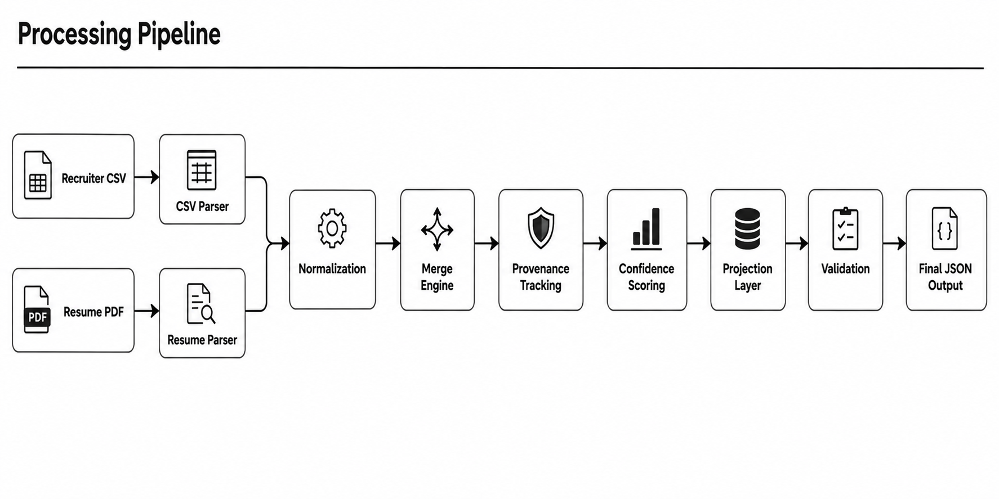

# Candidate Data Transformer

> Configurable candidate data transformation pipeline built for the **Eightfold AI Assignment** using Python.



---

## Overview

The Candidate Data Transformer consolidates structured and unstructured candidate information into a unified canonical JSON profile.

Currently supported data sources:

- 📄 Resume PDF (Unstructured)
- 📊 Recruiter CSV (Structured)

The pipeline extracts candidate information, normalizes values, resolves conflicts, tracks provenance, assigns confidence scores, validates the output, and generates a configurable JSON profile.

---

## Features

- Resume PDF Parsing
- Recruiter CSV Parsing
- Email Normalization
- Phone Number Normalization
- Merge Engine
- Provenance Tracking
- Confidence Scoring
- Runtime Configurable Projection
- Output Validation
- Canonical JSON Output

---

## Project Structure

```text
Candidate-Data-Transformer/
│
├── config/
│   ├── default_config.json
│   └── custom_config.json
│
├── docs/
│   ├── Candidate_Data_Transformer_Technical_Design.pdf
│   └── pipeline.png
│
├── input/
│   ├── recruiter.csv
│   └── resume.pdf
│
├── output/
│   └── final_output.json
│
├── src/
│   ├── confidence/
│   ├── merger/
│   ├── normalizer/
│   ├── parser/
│   ├── projection/
│   ├── config_loader.py
│   ├── validator.py
│   └── main.py
│
├── requirements.txt
├── README.md
└── .gitignore
```

---

## Processing Pipeline

1. Parse Recruiter CSV
2. Parse Resume PDF
3. Normalize extracted values
4. Merge candidate information
5. Track provenance
6. Assign confidence scores
7. Project configurable output
8. Validate required fields
9. Export final JSON profile

---

## Technologies Used

- Python 3.12
- Pandas
- pdfplumber
- phonenumbers
- dateparser
- Pydantic

---

## Installation

Clone the repository

```bash
git clone https://github.com/AashishPoddar/Candidate-Data-Transformer.git
cd Candidate-Data-Transformer
```

Create a virtual environment (recommended)

```bash
python -m venv venv

# Windows
venv\Scripts\activate
```

Install dependencies

```bash
pip install -r requirements.txt
```

---

## Run the Project

```bash
python src/main.py
```

---

## Input Sources

### Structured Source

Recruiter CSV

Fields

- Name
- Email
- Phone
- Current Company
- Title

### Unstructured Source

Resume PDF

Extracted Fields

- Name
- Email
- Phone

---

## Sample Output

```json
{
  "full_name": "AASHISH PODDAR",
  "email": "ap.poddaraashish@gmail.com",
  "phone": "+919798680838",
  "current_company": "Google",
  "title": "Software Engineer",
  "provenance": {
    "full_name": {
      "source": "Resume PDF",
      "method": "Regex"
    }
  },
  "confidence": {
    "full_name": 0.95
  }
}
```

The complete output is available in:

```text
output/final_output.json
```

---

## Configuration

The project supports runtime configurable output using:

- `config/default_config.json`
- `config/custom_config.json`

This allows users to choose which fields appear in the final JSON output without modifying the source code.

---

## Validation

The final candidate profile is validated before export.

Validation includes:

- Required fields
- Email format
- Phone normalization
- Canonical JSON structure

---

## Future Improvements

- OCR Support for Scanned Resumes
- AI-based Skill Extraction
- Dynamic Confidence Scoring
- Duplicate Candidate Detection
- LinkedIn Profile Integration
- GitHub Profile Integration

---

## Documentation

Technical design document:

```
docs/Candidate_Data_Transformer_Technical_Design.pdf
```

---

## Author

**Aashish Poddar**

Developed as part of the **Eightfold AI Candidate Data Transformer Assignment**.